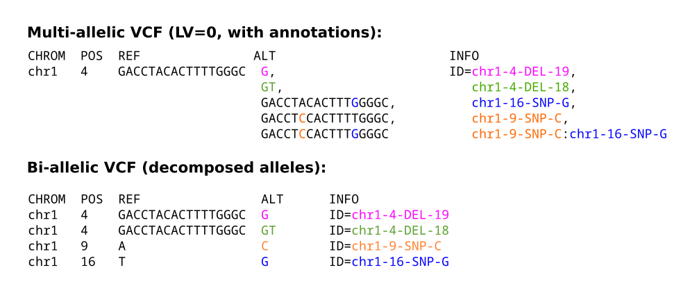

# Evaluation pipeline

This pipeline can be used to evaluate and benchmark the following three state-of-the-art graph-genome-based approaches: [PanGenie](https://github.com/eblerjana/pangenie), [BayesTyper](https://github.com/bioinformatics-centre/BayesTyper) and [GraphTyper](https://github.com/DecodeGenetics/graphtyper). 

## Pipeline Design

The pipeline contains the following components:

- Downloading required data: We download the specific input data. This includes the pangenome graphs and variant callsets (in both versions multiallelic and biallelic), short-read data of the samples we want to assess the performance on, references and callable regions.

- Preprocessing: We preprocess the input data with the following tasks: Indexing reads and reference, aligning reads to reference, removing untypable variants, leave-one-out splitting and determining biallelic/multiallelic-bubble regions.

- Re-Genotyping: We apply the three state-of-the-art genome-inference algorithms: PanGenie (several versions can be applied), BayesTyper and GraphTyper.

- Postprocessing: Every genotyped VCF file is converted to biallelic (i.e. one variant per row) to fairly compare all tools in the same format.

- Performance Assessment: We evaluate biallelic genotyped results by looking at the following metrics: Weighted Genotype Concordance (wGC), Fscore and runtime. Moreover, we use two different evaluation tools, depending on variant size: for SNPs and small/midsize variant (< 50bp), [RTG VCFeval](https://github.com/RealTimeGenomics/rtg-tools) method is used, whereas [truvari](https://github.com/ACEnglish/truvari) is used for Structural Variants (SVs). 


## Experiments

We applied the pipeline to the following data: A 64-haplotype Pangenome graph derived from the “Human Genome Structural Variation Consortium” (HGSVC) and the reads come from the standard benchmarking sample NA24385/HG002 of the “Genome In A Bottle” (GIAB) Consortium).

So far, only leave-one-out experiments are included (i.e. tool's genotyping performance is evaluated by removing one of the panel samples from the input VCF, and then genotyping it using a panel containing the remaining n-1 samples only).  External validation (i.e. using an external benchmarking truth dataset) is work in progress. 

## How to set up

The configuration file should have the following structure:

```yaml

### callsets to be used as input to genotyping tools (multiple ones can be listed)
callsets:
    HGSVC:
        # multi-allelic VCF file (compressed)
        multi: "/path/to/multiallelic-Pangenome-graph"
        # bi-allelic VCF file (compressed)
        bi: "/path/to/biallelic-Pangenome-graph"
        # reference genome in FASTA format
        reference: "/path/to/reference"
        # variants contained in the callset. Options are: snp|indels|large-deletion|large-insertion
        variants:
            - Variant1
            - Variant2
        # repeat annotations in BED format
        repeat_regions: "/path/to/repeats-bed"
        # samples to run a leave-one-out experiment on
        leave_one_out_samples: # specify the sample IDs to evaluate on (should match those of read data file)
            - SAMPLE_ID

# Summary of read data in TSV format. File required that specifies a sample name, path to FASTA/FASTQ data and superpopulation:
# FamilyID	SampleID	FatherID	MotherID	Population	Superpopulation	Sample_Illumina
# FamilyID: specifies the name of a trio
# SampleID: name of the child sample
# FatherID: name of the father (0 if not available)
# MotherID: name of the mother (0 if not available)
# Population: which population the sample is from (UNKNOWN if not known)
# Superpopulation: which superpopulation (AFR, AMR, EAS, EUR, SAS)
# Sample_Illumina: path to a (compressed) FASTA/FASTQ file with Illumina reads of the child
reads: "/path/to/read-table-file"

# PanGenie command. Different versions can be run by listing several commandlines
pangenie: {}
    
# PanGenie command to be used for modularised versions of PanGenie
pangenie-modules: 
    pangenie.v3: "/path/to/PanGenie-v3-executable"

# Downsampling coverages for leave-one-out experiment. If reads shall not be downsampled, leave empty.
downsampling: []

# Other programs
programs:
    rtg: "/path/to/RTG-Tools-executable"
    bwa: "/path/to/bwa-executable"
    bayestyper: "/path/to/BayesTyper-executable"
    bayestyper_tools: "/path/to/BayesTyper-Tools-executable"
    graphtyper: "/path/to/GraphTyper-executable"
    kmc: "/path/to/KMC-executable"
    truvari: "/path/to/truvari-executable"

# Other parameters
utils:
    bayestyper_reference_canon: "/path/to/canon-reference-for-Bayestyper"
    bayestyper_reference_decoy: "/path/to/decoy-reference-for-Bayestyper"
```


For instance, the configuration file used for our experiments is: 

```yaml

### callsets to be used as input to genotyping tools (multiple ones can be listed)
callsets:
    HGSVC:
        # multi-allelic VCF file
        multi: "data/downloaded/vcf/HGSVC-GRCh38/Pangenome_graph_freeze3_64haplotypes.vcf.gz"
        # bi-allelic VCF file
        bi: "data/downloaded/vcf/HGSVC-GRCh38/Callset_freeze3_64haplotypes.vcf.gz"
        # reference genome in FASTA format
        reference: "data/downloaded/fasta/GRCh38_full_analysis_set_plus_decoy_hla.fa"
        # variants contained in the callset. Options are: snp|indels|large-deletion|large-insertion
        variants:
            - snp 
            - indels
            - large-deletion
            - large-insertion
        # repeat annotations in BED format
        repeat_regions: "resources/ucsc-simple-repeats.bed"
        # samples to run a leave-one-out experiment on
        leave_one_out_samples: # specify the samples to evaluate on
            - NA24385

# read data. File required that specifies a sample name, path to FASTA/FASTQ data and superpopulation:
# FamilyID	SampleID	FatherID	MotherID	Population	Superpopulation	Sample_Illumina
reads: "resources/reads.tsv"

# PanGenie command. Different versions can be run by listing several commandlines
pangenie: {}
    
# PanGenie command to be used for modularised versions of PanGenie
pangenie-modules: 
    pangenie.v3: "/usr/local/bin/PanGenie_v3.0.0"

# Downsampling coverages for leave-one-out experiment. If reads shall not be downsampled, leave empty.
downsampling: []

# Other programs
programs:
    rtg: "/home/ubuntu/rtg-tools-3.12.1/rtg"
    bwa: "/usr/bin/bwa"
    bayestyper: "/usr/local/bin/bayesTyper"
    bayestyper_tools: "/usr/local/bin/bayesTyperTools"
    graphtyper: "/usr/local/bin/graphtyper"
    kmc: "/usr/bin/kmc"
    truvari: "/usr/local/bin/truvari"

# Other parameters
utils:
    bayestyper_reference_canon: "data/downloaded/bayestyper_utils/bayestyper_GRCh38_bundle_v1.3/GRCh38_canon.fa"
    bayestyper_reference_decoy: "data/downloaded/bayestyper_utils/bayestyper_GRCh38_bundle_v1.3/GRCh38_decoy.fa"
```  

## Required input data

### VCFs
This pipeline requires two input VCFs: a multi-allelic VCF representing bubbles and haplotypes in a pangenome graph ("multi"), and a bi-allelic callset VCF describing the underlying variant alleles ("bi"). In the mult-allelic VCF, each record represents a bubble in the graph and lists all paths covered by at least one haplotypes as the alternative allele sequences. Each such alternative allele is annotated by a sequence of variant IDs (separated by a colon) in the INFO field, indicating which individual variant alleles it is composed of (since bubbles are usually composed of many individual variant alleles). The bi-allelic VCF contains one separate record for each such variant ID. See the figure below for an illustration. Both VCFs describe the same genetic variation, but using different ways of representation. In this pipeline, the multi-allelic VCFs are used as input to PAnGenie and BayesTyper for genotyping, whereas GraphTyper requires a biallelic file. Using the annotations, the resulting bubble genotypes can be translated into genotypes for each individual variant ID. This enables properly analysing variant alleles contained inside of bubbles.



### reference 
FASTA file containing the reference genome underlying the VCF.

### reads
A TSV file of the format shown below that provides paths to (compressed) FASTA/FASTQ files with **short-read** sequencing data. One file per sample.

```bat

<FamilyID> <SampleID> <FatherID> <MotherID> <Sex> <Population> <Superpopulation> <SampleIllumina>

```

**FamilyID**: specifies the name of a trio  
**SampleID**: name of the child sample  
**FatherID**: name of the father (0 if not available)  
**MotherID**: name of the mother (0 if not available)  
**Population**: which population the sample is from (UNKNOWN if not known)  
**Superpopulation**: which superpopulation (AFR, AMR, EAS, EUR, SAS)  
**Sample_Illumina**: path to a FASTA/FASTQ file with Illumina reads of the child sample  

See  `` resources/reads.tsv `` for an example.

### repeat regions
BED file defining repeat regions. See `` resources/ `` folder for files that can be used for GRCh38 references.

## How to run the pipeline

**Requirements**

Within de.NBI, we recommend to mount a volume of at least 500 Gb, so not to run into disk memory because of the large size of short-read data. Moreover, follow the next instructions:

- Create and mount the volume following the [deNBI instructions](https://cloud.denbi.de/wiki/simple_vm/volumes/) and navigate until the desired directory within the volume, where the experiments will be carried out.  
- Clone this repository with `https://github.com/DiltheyLab/graph-genome-workbench.git` and navigate to `evaluation_pipeline`.
- Specify paths to input files and parameters needed in the config file: `` config/config.yaml `` as explained above. (applicable if input data is already at hand).
- Run `conda install -n base -c conda-forge mamba` in order to be able to use the `--use-conda` attribute in Snakemake.

**Testing**

We tested the pipeline in `de.NBI highmem large` VMs with a 1.5-Tb volume mounted.  

**Execution**

Regarding the pipeline execution, we splitted the pipeline into two workflows to separate between the data download step and the rest (benefitial if data is already at hand). 

The download data workflow can be run using the following command:

``  snakemake --profile workflow/profiles download_data  `` 

The leave-one-out workflow can be run using the following command:

``  snakemake --profile workflow/profiles leave_one_out  ``

## Acknowledgements

This pipeline has been adapted from: https://github.com/eblerjana/genotyping-pipelines.


